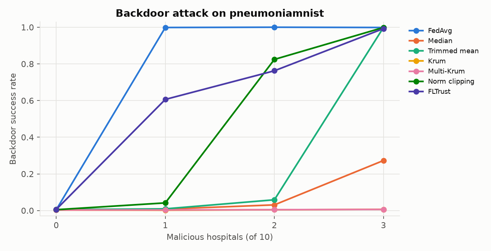
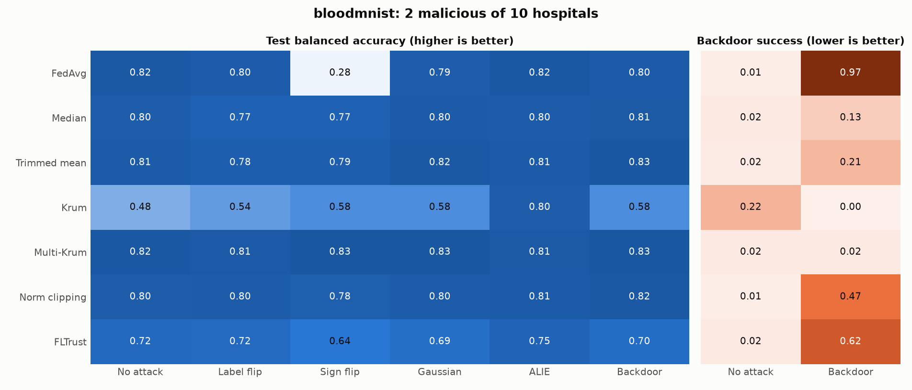
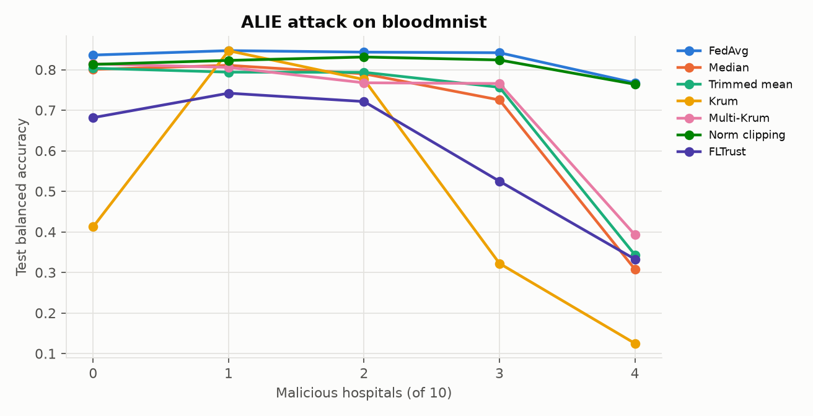
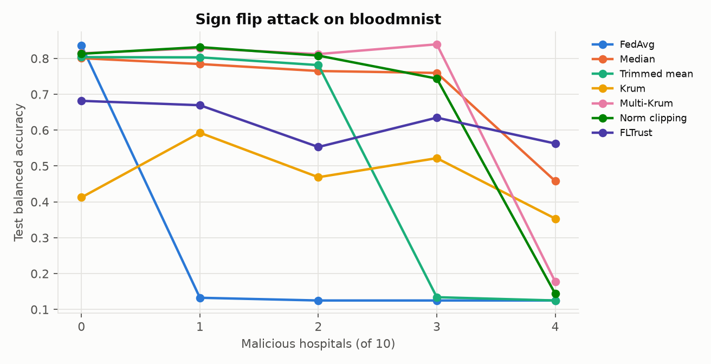

# FedSecHealth

**A reproducible testbed for privacy & security attacks and defenses in federated learning on medical data.**

[](https://github.com/Tag59/FedSecHealth/actions/workflows/ci.yml)


🇬🇧 English · [🇫🇷 Français](#-version-française)

---

Hospitals want to train models together without sharing patient records.
Federated Learning (FL) promises exactly that: only model updates leave the
hospital. **But gradients leak data, and participants can lie.**
FedSecHealth simulates hospitals collaborating on diagnostic models (clinical
tables, chest X-rays, blood smears) and attacks them from both sides:

- **Privacy:** an honest-but-curious server **reconstructs patient data from
  gradients**; defenses: **Differential Privacy (DP-SGD)**.
- **Integrity:** **malicious hospitals** poison the shared model (sabotage,
  hidden backdoors); defenses: **Byzantine-robust aggregation** (median,
  trimmed mean, Krum, norm clipping, FLTrust).

Every attack and defense is measured on the same footing: utility, attack
success, and what each protection costs.

<p align="center"></p>
<p align="center"><em>Chest X-rays reconstructed by the server from single-image gradients
(Inverting Gradients, PneumoniaMNIST). Top: real images. Rows: increasing DP noise σ and the
corresponding formal budget ε. Numbers: SSIM to the real image (1 = identical).</em></p>

## Key findings

**Integrity: malicious hospitals (v0.3)**

<p align="center"></p>
<p align="center"><em>A backdoor makes the shared model call a pneumonia X-ray "normal"
whenever a small white marker is in the corner. With plain FedAvg, one malicious
hospital out of ten is enough.</em></p>

1. **One hospital is enough to plant a medical backdoor.** With FedAvg, a
   single malicious hospital out of 10 makes **99.8 %** of marked pneumonia
   X-rays classified as normal, while accuracy on clean X-rays does not drop
   (0.81 vs. 0.79 balanced accuracy): the backdoor is invisible to standard
   validation.
2. **No aggregation rule wins everywhere.** Robust statistics stop crude
   attacks (one sign-flipping lab drives FedAvg to chance level, 0.13, while
   median / trimmed mean / Multi-Krum stay near 0.80), but **ALIE**, which
   hides inside the natural spread of honest updates, breaks them: with 4
   attackers out of 10, median falls to 0.31 and Krum to 0.13 (it picks the
   attacker's update in **100 %** of rounds), while plain FedAvg keeps 0.77.
   Choosing a defense means choosing a threat model.
3. **Robustness has a price on heterogeneous data.** Without any attack,
   Krum keeps a single lab's update per round and drops BloodMNIST balanced
   accuracy from 0.82 to 0.48; FLTrust (100 trusted samples) to 0.72.
   Multi-Krum was the best compromise here (0.81 to 0.83 under every attack
   with 2 attackers, backdoor success at baseline).
4. **Defenses fail abruptly past their budget.** Trimmed mean (β = 0.2, i.e.
   2 values trimmed per side) blocks the backdoor with 2 attackers (6 %) and
   lets it through with 3 (99.8 %).

**Privacy: curious server (v0.1 and v0.2)**

1. **Gradients leak medical images almost perfectly.** Inverting Gradients
   reconstructs chest X-rays from a single-image gradient with median
   **SSIM 0.98 / PSNR 36 dB** (100 % of 20 targets), and blood cell images
   with SSIM 0.72 (80 %).
2. **Clipping alone does nothing.** Per-sample clipping only rescales the
   gradient; cosine-based attacks are scale-invariant (same SSIM 0.98).
3. **"Having DP" is not the point; the amount of noise is.** With σ = 0.001
   (a formal ε ≈ 3 × 10⁸, i.e. no meaningful guarantee), X-rays are still
   reconstructed at SSIM 0.97. The attack breaks between σ = 0.01 and 0.1,
   and a real budget (ε = 8, σ ≈ 0.9) leaves only noise (SSIM 0.15).
4. **The diagnosis leaks before the image.** On BloodMNIST at σ = 0.01, the
   image is no longer recognisable (SSIM 0.37) but the cell type is still
   recovered for **95 %** of targets (chance: 12.5 %).
5. **Federation pays off, DP costs a lot on images.** Five labs with skewed
   BloodMNIST data: alone **0.545** balanced accuracy, federated **0.814**,
   centralized 0.918. DP-SGD at ε = 16 drops the federated model to 0.690.

## Results in detail

### Malicious hospitals (v0.3)

**Every attack against every defense** (BloodMNIST, 10 labs, Dirichlet α = 0.5,
2 malicious, 20 rounds, mean of 2 seeds):

<p align="center"></p>

| Aggregator | No attack | Label flip | Sign flip ×5 | Gaussian | ALIE | Backdoor | Backdoor success |
|---|---|---|---|---|---|---|---|
| FedAvg | 0.818 | 0.798 | **0.278** | 0.793 | 0.821 | 0.804 | **97.0 %** |
| Median | 0.797 | 0.766 | 0.769 | 0.803 | 0.802 | 0.812 | 13.0 % |
| Trimmed mean (β = 0.2) | 0.807 | 0.783 | 0.786 | 0.817 | 0.806 | 0.827 | 20.6 % |
| Krum | **0.482** | 0.537 | 0.579 | 0.579 | 0.796 | 0.579 | 0.3 % |
| Multi-Krum | 0.824 | 0.810 | 0.830 | 0.830 | 0.813 | 0.830 | 2.3 % |
| Norm clipping | 0.795 | 0.802 | 0.781 | 0.802 | 0.807 | 0.816 | 47.1 % |
| FLTrust | 0.721 | 0.717 | 0.644 | 0.690 | 0.751 | 0.704 | 61.9 % |

*Balanced accuracy on the test set (8 cell types, chance = 0.125). Backdoor
success: triggered test images (true class ≠ target) classified as the target;
the rate for clean models is 1 to 2 % (22 % for Krum, whose weak model
over-predicts the target class).*

**How many attackers can each defense take?** (one seed, 1 to 4 malicious of 10)

<p align="center">


</p>

| Malicious labs | 0 | 1 | 2 | 3 | 4 |
|---|---|---|---|---|---|
| ALIE vs. FedAvg | 0.836 | 0.847 | 0.843 | 0.842 | **0.767** |
| ALIE vs. Median | 0.801 | 0.811 | 0.790 | 0.725 | **0.308** |
| ALIE vs. Krum | 0.412 | 0.847 | 0.776 | 0.322 | **0.125** |
| Sign flip vs. FedAvg | 0.836 | **0.133** | 0.125 | 0.125 | 0.125 |
| Sign flip vs. Median | 0.801 | 0.784 | 0.765 | 0.760 | 0.458 |
| Sign flip vs. Multi-Krum | 0.814 | 0.828 | 0.812 | 0.839 | 0.177 |

Krum is configured for the worst case it can tolerate (f = 3 for 10 clients).
With one ALIE attacker, Krum's accuracy *rises* (0.41 to 0.85): the attacker's
update is close to the benign mean, so selecting it every round is better than
selecting one skewed lab.

**Medical backdoor** (PneumoniaMNIST, 10 hospitals, target "normal", boost ×5, 2 seeds):

| Aggregator | Backdoor success, 1 / 2 / 3 malicious | Clean balanced accuracy (1 malicious) |
|---|---|---|
| FedAvg | **99.8 %** / 100 % / 99.8 % | 0.814 |
| Median | 0.8 % / 3.1 % / 27.3 % | 0.782 |
| Trimmed mean | 0.9 % / 5.9 % / **99.8 %** | 0.788 |
| Krum | 0.2 % / 0.5 % / 0.6 % | 0.756 |
| Multi-Krum | 0.3 % / 0.5 % / 0.6 % | 0.772 |
| Norm clipping | 4.2 % / 82.4 % / 99.8 % | 0.779 |
| FLTrust | 60.6 % / 76.2 % / 99.2 % | 0.734 |

The boosted backdoor update is large, so distance-based rules (Krum,
Multi-Krum) exclude it every round; norm clipping and FLTrust neutralise the
boost but still let the poisoned *direction* through. A stealthier attacker
(no boost, spread over more rounds) is the next thing to test.

### Imaging (v0.2)

**Where gradient inversion breaks** (PneumoniaMNIST, single image, fresh CNN, 20 targets):

<p align="center"></p>

| Defense | Formal ε | iDLG SSIM | DLG SSIM | Inverting Gradients SSIM (success) |
|---|---|---|---|---|
| None | ∞ | 0.20 | 0.20 | **0.98** (100 %) |
| Clipping only | ∞ | 0.02 | 0.12 | **0.98** (100 %) |
| σ = 0.001 | 2.7 × 10⁸ | 0.02 | 0.13 | **0.97** (100 %) |
| σ = 0.01 | 2.7 × 10⁶ | 0.02 | 0.07 | 0.69 (85 %) |
| σ = 0.1 | 1.0 × 10⁴ | 0.02 | 0.04 | 0.18 (0 %) |
| DP-SGD, σ = 0.91 | **8** | 0.01 | 0.03 | 0.15 (0 %) |

*Success: SSIM ≥ 0.6. ε is computed with the RDP accountant for the hospital's
real training schedule (20 rounds, batch 64, δ = 1e-5).*

**Harder settings for the attacker** (Inverting Gradients):

| Setting | No defense | Clipping only | ε = 8 |
|---|---|---|---|
| Fresh model, 1 image | SSIM 0.98 (100 %) | 0.98 (100 %) | 0.15 (0 %) |
| Trained model (10 rounds), 1 image | SSIM 0.99 (100 %) | 0.99 (100 %) | 0.16 (0 %) |
| Fresh model, batch of 4 | SSIM 0.79 (100 %) | 0.80 (100 %) | 0.12 (0 %) |
| Fresh model, batch of 16 | SSIM 0.48 (0 %) | 0.50 (20 %) | 0.10 (0 %) |

- A trained model does not protect patients without noise, but its smaller
  gradients make the attack degrade faster once noise is added (60 % success at
  σ = 0.001 vs. 100 % on a fresh model).
- Batching helps, without guaranteeing anything: with 16 X-rays per gradient,
  about half remain recognisable (see
  [gallery](docs/figures/pneumonia_batch16_gallery_ig.png)). Batch attacks assume
  the server knows the labels, a stronger attacker.

**Blood cells (BloodMNIST, RGB)**:

<p align="center"></p>

**Federated training and DP cost** (BloodMNIST, 5 labs, Dirichlet α = 0.3, 3 seeds):

<p align="center"></p>

| Setting | Balanced accuracy | Inverting Gradients success |
|---|---|---|
| Each lab alone (mean) | 0.545 | n/a |
| Federated, no DP | **0.814 ± 0.017** | 70 % |
| Federated, DP ε = 16 | 0.690 ± 0.010 | 0 % |
| Federated, DP ε = 4 | 0.678 ± 0.010 | 0 % |
| Federated, DP ε = 1 | 0.607 ± 0.013 | 0 % |
| Centralized (pooled data, not private) | 0.918 | n/a |

### Tabular (v0.1, Breast Cancer Wisconsin)

**Federation helps when hospitals differ.** Five hospitals with label-skewed data
(Dirichlet α = 0.3), 5 seeds: alone **0.718**, federated **0.975**, centralized 0.977.

<p align="center"></p>

**One gradient is enough to recover a patient record exactly:**

| Feature | Real patient | Reconstructed (no DP) | Reconstructed (DP, ε=5) |
|---|---:|---:|---:|
| diagnosis | malignant | malignant | benign |
| mean radius | 15.100 | 15.100 | 6.877 |
| mean texture | 22.020 | 22.020 | 11.097 |
| mean perimeter | 97.260 | 97.260 | 194.077 |
| mean area | 712.800 | 712.802 | 1651.659 |
| mean smoothness | 0.091 | 0.091 | 0.030 |
| mean compactness | 0.071 | 0.071 | 0.480 |

*iDLG on a freshly initialised model; first 6 of 30 features shown.*

**Privacy/utility trade-off:**

<p align="center"></p>

| Privacy budget ε | Accuracy, 3 hospitals IID | Accuracy, 5 hospitals non-IID | Analytic | iDLG | DLG |
|---|---|---|---|---|---|
| 0.5 | 0.900 ± 0.023 | 0.775 ± 0.078 | 0% | 0% | 0% |
| 1 | 0.954 ± 0.007 | 0.879 ± 0.029 | 0% | 0% | 0% |
| 2 | 0.960 ± 0.015 | 0.947 ± 0.021 | 0% | 0% | 0% |
| 5 | 0.965 ± 0.006 | 0.965 ± 0.006 | 0% | 0% | 0% |
| 10 | 0.967 ± 0.009 | 0.967 ± 0.007 | 0% | 0% | 0% |
| 50 | 0.968 ± 0.007 | 0.965 ± 0.008 | 0% | 0% | 0% |
| ∞ (no DP) | 0.975 ± 0.010 | 0.975 ± 0.007 | 100% | 97% | 63% |
| clipping only (σ = 0) | n/a | n/a | 100% | 33% | 67% |

*Accuracy: mean ± std over 5 seeds after 30 rounds. Attack success: share of 30
target patients (IID config, batch of 1) reconstructed with < 10 % relative error.*

On tabular data even ε = 50 stops all three attacks: a single patient's clipped
gradient (norm ≤ 1) is spread over ~4 k parameters, while noise (σ ≈ 0.6) is
added to every coordinate. Heterogeneity makes DP more expensive: at ε = 1,
accuracy is 95.4 % IID but 87.9 % non-IID.

## Limitations

- Attacks observe a single local gradient step (FedSGD), the standard worst-case
  benchmark; multi-step FedAvg updates are harder to invert.
- 28×28 images and small CNNs; 20 targets per imaging setting (5 for batch
  studies), so success rates are indicative.
- DP hyper-parameters were not tuned for imaging (same learning rate and batch
  size as without DP); the utility cost reported here is an upper bound.
- For ε = 0.5 on tabular data, Opacus warns that the RDP bound is loose: the
  reported ε is conservative.
- Poisoning: 2 seeds for the grids and 1 for the sweeps; attackers are not
  adaptive (they ignore which defense is deployed), and the backdoor uses a
  large boost that distance-based rules detect easily. Stealthier, defense-aware
  attacks would lower the robust aggregators' numbers.

## What's inside

| Component | Details |
|---|---|
| Data | Breast Cancer Wisconsin; MedMNIST (PneumoniaMNIST, BloodMNIST, DermaMNIST); IID or **Dirichlet non-IID** splits; **federated standardisation** (hospitals only share sums, never records) |
| Models | MLP, CNN with GroupNorm (Opacus-compatible), LeNet (DLG reference) |
| FL engine | Deterministic FedAvg simulator in pure PyTorch; centralized and local-only baselines; accuracy and balanced accuracy |
| Attacks | **Analytic** linear-layer inversion, **DLG**, **iDLG**, **Inverting Gradients**; attacks only see what the server sees |
| Poisoning | Malicious hospitals: **label flipping**, **sign flipping**, **Gaussian** updates, **ALIE**, **backdoor** with trigger + model-replacement boost |
| Defenses | **DP-SGD** per hospital via Opacus, RDP (ε, δ) accounting; **robust aggregation**: coordinate-wise median, trimmed mean, Krum, Multi-Krum, norm clipping, FLTrust |
| Metrics | Relative error / cosine (tabular); PSNR / SSIM with Hungarian matching (images); balanced accuracy, backdoor success with clean baseline, influence kept by attackers |
| Engineering | `src/` package, typed YAML configs, CLI, 37 tests, CI (ruff + pytest), one-command reproduction |

## Threat models

**Curious server (privacy).**

- **Adversary:** an *honest-but-curious* aggregation server (or anyone who
  intercepts updates). It follows the protocol, knows the architecture and the
  current weights, and observes each hospital's update.
- **Goal:** recover the private inputs (records or images) and labels (diagnosis).
- **Setting:** the update is the gradient of one local step (FedSGD), on a
  freshly initialised or a trained global model.
- **Success:** relative L2 error < 10 % (tabular); SSIM ≥ 0.6 in pixel space (images).
- **DP noise in attacks** is calibrated with the *same* schedule as training
  (sampling rate, number of steps, δ = 1e-5), so each ε is the budget a hospital
  would actually spend.

**Malicious hospitals (integrity).**

- **Adversary:** *f* of the *n* hospitals, colluding. They respect the message
  format but may train on poisoned data and send arbitrary updates. The server
  does not know which hospitals are malicious; the honest server is trusted.
- **Goals:** *untargeted* (degrade the shared model: label flip, sign flip,
  Gaussian, ALIE) or *targeted* (backdoor: a hidden trigger forces a chosen
  diagnosis while clean accuracy stays intact).
- **Knowledge:** ALIE is run in its omniscient variant (it knows the benign
  updates), a strong attacker. Attackers do not adapt to the specific defense.
- **Defender:** Krum is configured with the largest *f* the experiment
  considers; FLTrust holds 100 trusted samples (carved out of the test set, so
  every rule is evaluated on the same remaining samples).

## Quick start

```bash
git clone https://github.com/Tag59/FedSecHealth && cd FedSecHealth
uv sync                                               # installs CPU PyTorch + deps
uv run fedsechealth robustness -c configs/pneumonia_backdoor.yaml # malicious hospitals
uv run fedsechealth attack   -c configs/pneumonia_attack.yaml     # X-ray reconstruction
uv run fedsechealth train    -c configs/bloodmnist_noniid.yaml    # federated training
uv run fedsechealth tradeoff -c configs/breast_cancer_iid.yaml    # ε vs. accuracy vs. attacks
uv run fedsechealth demo     -c configs/breast_cancer_iid.yaml --epsilon 5
uv run pytest
```

Override any config value: `-s fl.rounds=10 -s attack.batch_size=4 -s "attack.methods=[ig]"`.
Outputs (JSON + figures) go to `results/<experiment name>/`. MedMNIST is
downloaded on first use to `~/.medmnist`. `scripts/reproduce.sh` regenerates
every result in this README (several hours on CPU); see
[docs/GPU.md](docs/GPU.md) for GPU setup.

## Project layout

```
src/fedsechealth/
  data.py          datasets, IID / Dirichlet partitions, federated standardisation
  models.py        MLP, CNN (GroupNorm), LeNet
  fl.py            hospitals, FedAvg / robust training loop, baselines, DP-SGD, evaluation
  privacy.py       DP config, noise calibration, epsilon accounting, DP gradient release
  attacks/
    gradient_inversion.py   analytic, DLG, iDLG, Inverting Gradients
    metrics.py              rel. error, cosine, PSNR, SSIM, batch matching
    poisoning.py            malicious hospitals: label/sign flip, Gaussian, ALIE, backdoor
  defenses/
    aggregation.py          FedAvg, median, trimmed mean, (Multi-)Krum, norm clipping, FLTrust
  experiments.py   train / attack / trade-off / robustness / demo pipelines
  plotting.py      figures (curves, trade-offs, galleries, noise sweeps, robustness heatmaps)
  cli.py           command-line interface
configs/           YAML experiment definitions
scripts/           reproduction script
tests/             pytest suite
```

## Roadmap

Membership inference and secure aggregation, then Flower/Docker deployment and a
dashboard. See [ROADMAP.md](ROADMAP.md).

## References

- McMahan et al., *Communication-Efficient Learning of Deep Networks from Decentralized Data*, AISTATS 2017.
- Abadi et al., *Deep Learning with Differential Privacy*, CCS 2016.
- Phong et al., *Privacy-Preserving Deep Learning via Additively Homomorphic Encryption*, IEEE TIFS 2017.
- Zhu, Liu, Han, *Deep Leakage from Gradients*, NeurIPS 2019.
- Zhao, Mopuri, Bilen, *iDLG: Improved Deep Leakage from Gradients*, 2020.
- Geiping et al., *Inverting Gradients: How easy is it to break privacy in federated learning?*, NeurIPS 2020.
- Hsu, Qi, Brown, *Measuring the Effects of Non-Identical Data Distribution for Federated Visual Classification*, 2019.
- Yang et al., *MedMNIST v2: A Large-Scale Lightweight Benchmark for 2D and 3D Biomedical Image Classification*, Scientific Data 2023.
- Wang et al., *Image Quality Assessment: From Error Visibility to Structural Similarity*, IEEE TIP 2004.
- Blanchard et al., *Machine Learning with Adversaries: Byzantine Tolerant Gradient Descent*, NeurIPS 2017.
- Yin et al., *Byzantine-Robust Distributed Learning: Towards Optimal Statistical Rates*, ICML 2018.
- Baruch, Baruch, Goldberg, *A Little Is Enough: Circumventing Defenses for Distributed Learning*, NeurIPS 2019.
- Sun et al., *Can You Really Backdoor Federated Learning?*, 2019.
- Bagdasaryan et al., *How To Backdoor Federated Learning*, AISTATS 2020.
- Cao et al., *FLTrust: Byzantine-robust Federated Learning via Trust Bootstrapping*, NDSS 2021.
- Gu, Dolan-Gavitt, Garg, *BadNets: Identifying Vulnerabilities in the Machine Learning Model Supply Chain*, 2017.

---

## 🇫🇷 Version française

**Un banc d'essai reproductible des attaques et défenses sur la vie privée et la sécurité en apprentissage fédéré appliqué aux données médicales.**

Des hôpitaux veulent entraîner un modèle commun sans partager les dossiers de
leurs patients. Le Federated Learning (FL) le permet : seules les mises à jour
du modèle quittent l'hôpital. **Mais les gradients laissent fuiter les
données, et les participants peuvent mentir.** FedSecHealth simule des
hôpitaux qui collaborent sur des modèles de diagnostic (données cliniques,
radios thoraciques, frottis sanguins) et les attaque sur deux fronts :

- **Vie privée :** un serveur « honnête mais curieux » **reconstruit les
  données des patients à partir des gradients** ; défense : la
  **confidentialité différentielle (DP-SGD)**.
- **Intégrité :** des **hôpitaux malveillants** empoisonnent le modèle commun
  (sabotage, backdoors cachées) ; défenses : l'**agrégation robuste** (médiane,
  moyenne tronquée, Krum, clipping de norme, FLTrust).

### Résultats principaux : hôpitaux malveillants (v0.3)

1. **Un seul hôpital suffit à implanter une backdoor médicale.** Avec FedAvg,
   un hôpital malveillant sur 10 fait classer **99,8 %** des radios de
   pneumonie marquées d'un petit carré blanc comme « normales », sans aucune
   baisse de précision sur les radios propres : la backdoor est invisible à
   une validation classique.
2. **Aucune règle d'agrégation ne gagne partout.** Les statistiques robustes
   arrêtent les attaques grossières (un seul labo qui inverse le signe de sa
   mise à jour ramène FedAvg au hasard, 0,13, alors que la médiane, la moyenne
   tronquée et Multi-Krum restent vers 0,80), mais **ALIE**, qui se cache dans
   la variance naturelle des mises à jour honnêtes, les fait tomber : avec 4
   attaquants sur 10, la médiane chute à 0,31 et Krum à 0,13 (il choisit la
   mise à jour de l'attaquant à **100 %** des rounds), tandis que FedAvg garde
   0,77. Choisir une défense, c'est choisir un modèle de menace.
3. **La robustesse a un coût sur des données hétérogènes.** Sans attaque, Krum
   fait tomber la précision équilibrée de 0,82 à 0,48, FLTrust à 0,72.
   Multi-Krum est le meilleur compromis ici.
4. **Les défenses cèdent brutalement au-delà de leur budget.** La moyenne
   tronquée (2 valeurs retirées de chaque côté) bloque la backdoor avec 2
   attaquants (6 %) et la laisse passer avec 3 (99,8 %).

### Résultats principaux : serveur curieux (v0.1 et v0.2)

1. **Les gradients révèlent les images médicales presque parfaitement.**
   Inverting Gradients reconstruit des radios thoraciques à partir du gradient
   d'une seule image avec un **SSIM médian de 0,98** (100 % des 20 cibles), et
   des images de cellules sanguines avec un SSIM de 0,72 (80 %).
2. **Le clipping seul ne protège pas.** Il ne fait que changer l'échelle du
   gradient, et les attaques fondées sur la similarité cosinus y sont insensibles.
3. **Ce qui compte n'est pas « d'avoir de la DP », mais la quantité de bruit.**
   Avec σ = 0,001 (un ε formel d'environ 3 × 10⁸, c'est-à-dire aucune garantie
   réelle), les radios sont encore reconstruites (SSIM 0,97). L'attaque casse
   entre σ = 0,01 et 0,1, et un vrai budget (ε = 8) ne laisse que du bruit.
4. **Le diagnostic fuit avant l'image.** Sur BloodMNIST à σ = 0,01, l'image
   n'est plus reconnaissable (SSIM 0,37) mais le type de cellule est retrouvé
   dans **95 %** des cas (hasard : 12,5 %).
5. **La fédération est rentable, la DP coûte cher sur images.** Cinq
   laboratoires aux données déséquilibrées (BloodMNIST) : seul **0,545** de
   précision équilibrée, fédéré **0,814**, centralisé 0,918. Avec DP à ε = 16,
   le modèle fédéré tombe à 0,690.
6. **Sur données tabulaires**, un seul gradient suffit à retrouver exactement
   un dossier patient (100 % pour l'attaque analytique), et la DP met toutes les
   attaques en échec pour une précision de 96,5 % à ε = 5 (97,5 % sans DP).

### Limites

Attaques sur un seul pas de gradient local (le pire cas de référence),
images 28×28 et petits CNN, 20 cibles par réglage (5 pour les lots). Les
hyperparamètres de la DP n'ont pas été optimisés pour l'imagerie : le coût en
précision rapporté ici est donc une borne haute. Pour l'empoisonnement : 2
graines pour les grilles, 1 pour les balayages, et des attaquants non adaptatifs
(ils ignorent la défense déployée) ; la backdoor utilise un fort facteur
d'amplification, facile à détecter pour les règles fondées sur les distances.

### Modèles de menace

**Hôpitaux malveillants.** *f* hôpitaux sur *n*, qui peuvent se coordonner,
respectent le format des messages mais peuvent s'entraîner sur des données
empoisonnées et envoyer des mises à jour arbitraires. Le serveur, honnête, ne
sait pas lesquels sont malveillants. Les attaques visent soit à dégrader le
modèle (inversion d'étiquettes ou de signe, bruit, ALIE), soit à y cacher une
backdoor. ALIE est jouée dans sa variante omnisciente (attaquant fort) ; les
attaquants ne s'adaptent pas à la défense déployée.

**Serveur curieux.** Le serveur d'agrégation suit le protocole mais cherche à apprendre des
informations sur les patients. Il connaît l'architecture et les poids, et
observe la mise à jour de chaque hôpital. Une reconstruction est réussie si
l'erreur relative est inférieure à 10 % (tabulaire) ou si le SSIM atteint 0,6
(images). Le bruit DP utilisé dans les attaques est calibré sur le même
calendrier que l'entraînement, donc chaque ε correspond au budget réellement
dépensé par un hôpital.

### Démarrage rapide

```bash
uv sync
uv run fedsechealth robustness -c configs/pneumonia_backdoor.yaml
uv run fedsechealth attack   -c configs/pneumonia_attack.yaml
uv run fedsechealth train    -c configs/bloodmnist_noniid.yaml
uv run fedsechealth tradeoff -c configs/breast_cancer_iid.yaml
```

### Feuille de route

Inférence d'appartenance et agrégation sécurisée, puis déploiement
Flower/Docker et tableau de bord. Voir [ROADMAP.md](ROADMAP.md).

## License

MIT, see [LICENSE](LICENSE).
