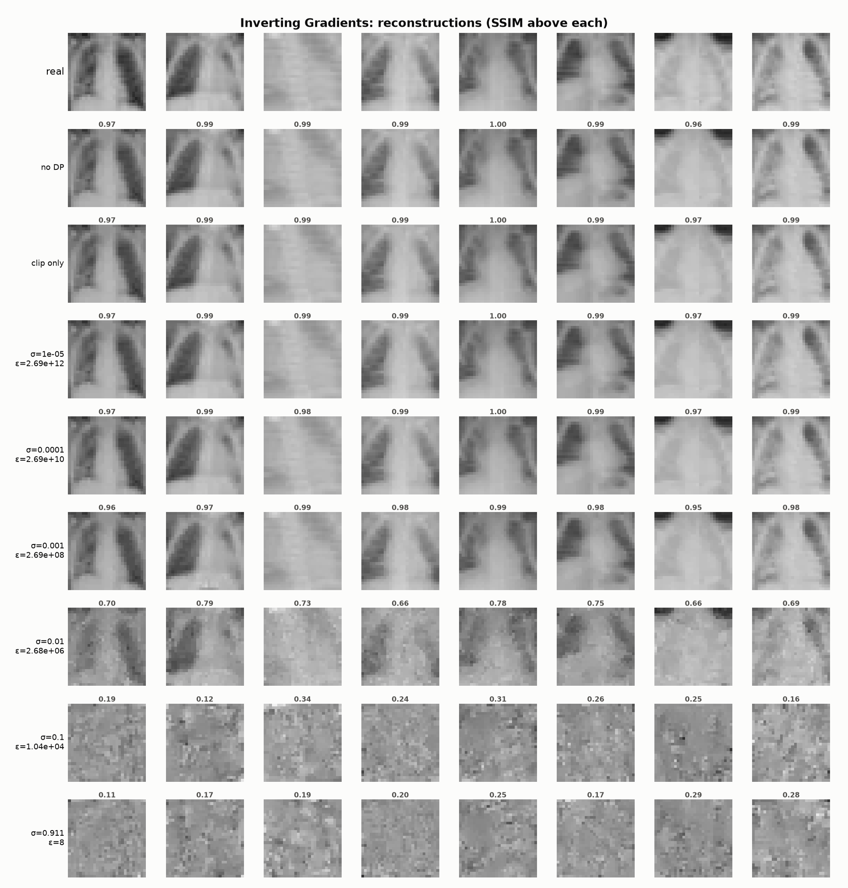
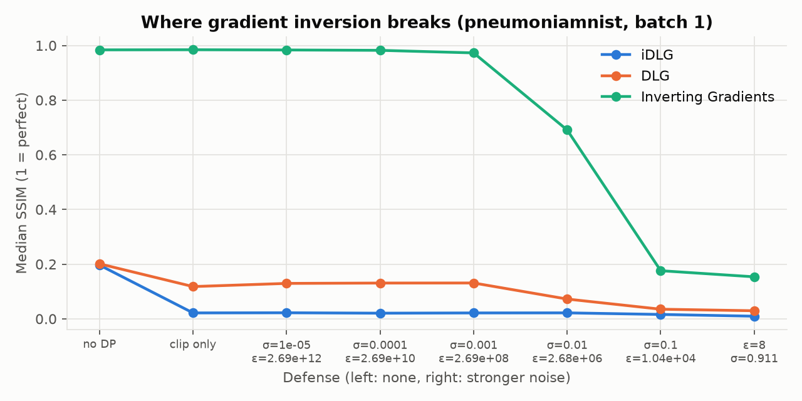
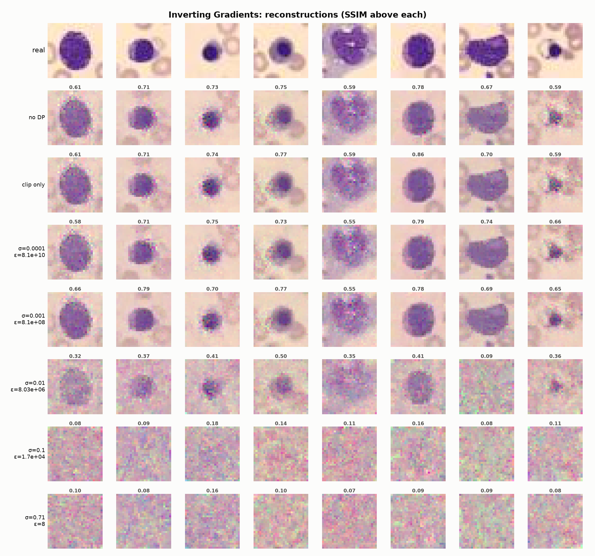
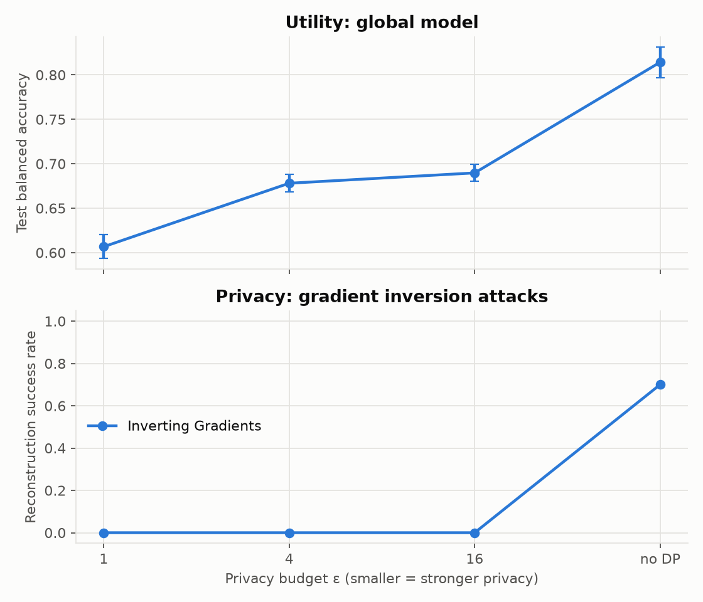

# FedSecHealth

**A reproducible testbed for privacy & security attacks and defenses in federated learning on medical data.**

[](https://github.com/Tag59/FedSecHealth/actions/workflows/ci.yml)


🇬🇧 English · [🇫🇷 Français](#-version-française)

---

Hospitals want to train models together without sharing patient records.
Federated Learning (FL) promises exactly that: only model updates leave the
hospital. **But gradients leak data.** FedSecHealth simulates hospitals
collaborating on diagnostic models (clinical tables, chest X-rays, blood
smears), lets an honest-but-curious server **reconstruct patient data from
their gradients**, and measures how well defenses such as **Differential
Privacy (DP-SGD)** stop the attack, and at what cost in accuracy.

<p align="center"></p>
<p align="center"><em>Chest X-rays reconstructed by the server from single-image gradients
(Inverting Gradients, PneumoniaMNIST). Top: real images. Rows: increasing DP noise σ and the
corresponding formal budget ε. Numbers: SSIM to the real image (1 = identical).</em></p>

## Key findings

1. **Gradients leak medical images almost perfectly.** Inverting Gradients
   reconstructs chest X-rays from a single-image gradient with median
   **SSIM 0.98 / PSNR 36 dB** (100 % of 20 targets), and blood cell images
   with SSIM 0.72 (80 %).
2. **Clipping alone does nothing.** Per-sample clipping only rescales the
   gradient; cosine-based attacks are scale-invariant (same SSIM 0.98).
3. **"Having DP" is not the point; the amount of noise is.** With σ = 0.001
   (a formal ε ≈ 3 × 10⁸, i.e. no meaningful guarantee), X-rays are still
   reconstructed at SSIM 0.97. The attack breaks between σ = 0.01 and 0.1,
   and a real budget (ε = 8, σ ≈ 0.9) leaves only noise (SSIM 0.15).
4. **The diagnosis leaks before the image.** On BloodMNIST at σ = 0.01, the
   image is no longer recognisable (SSIM 0.37) but the cell type is still
   recovered for **95 %** of targets (chance: 12.5 %).
5. **Federation pays off, DP costs a lot on images.** Five labs with skewed
   BloodMNIST data: alone **0.545** balanced accuracy, federated **0.814**,
   centralized 0.918. DP-SGD at ε = 16 drops the federated model to 0.690.

## Results in detail

### Imaging (v0.2)

**Where gradient inversion breaks** (PneumoniaMNIST, single image, fresh CNN, 20 targets):

<p align="center"></p>

| Defense | Formal ε | iDLG SSIM | DLG SSIM | Inverting Gradients SSIM (success) |
|---|---|---|---|---|
| None | ∞ | 0.20 | 0.20 | **0.98** (100 %) |
| Clipping only | ∞ | 0.02 | 0.12 | **0.98** (100 %) |
| σ = 0.001 | 2.7 × 10⁸ | 0.02 | 0.13 | **0.97** (100 %) |
| σ = 0.01 | 2.7 × 10⁶ | 0.02 | 0.07 | 0.69 (85 %) |
| σ = 0.1 | 1.0 × 10⁴ | 0.02 | 0.04 | 0.18 (0 %) |
| DP-SGD, σ = 0.91 | **8** | 0.01 | 0.03 | 0.15 (0 %) |

*Success: SSIM ≥ 0.6. ε is computed with the RDP accountant for the hospital's
real training schedule (20 rounds, batch 64, δ = 1e-5).*

**Harder settings for the attacker** (Inverting Gradients):

| Setting | No defense | Clipping only | ε = 8 |
|---|---|---|---|
| Fresh model, 1 image | SSIM 0.98 (100 %) | 0.98 (100 %) | 0.15 (0 %) |
| Trained model (10 rounds), 1 image | SSIM 0.99 (100 %) | 0.99 (100 %) | 0.16 (0 %) |
| Fresh model, batch of 4 | SSIM 0.79 (100 %) | 0.80 (100 %) | 0.12 (0 %) |
| Fresh model, batch of 16 | SSIM 0.48 (0 %) | 0.50 (20 %) | 0.10 (0 %) |

- A trained model does not protect patients without noise, but its smaller
  gradients make the attack degrade faster once noise is added (60 % success at
  σ = 0.001 vs. 100 % on a fresh model).
- Batching helps, without guaranteeing anything: with 16 X-rays per gradient,
  about half remain recognisable (see
  [gallery](docs/figures/pneumonia_batch16_gallery_ig.png)). Batch attacks assume
  the server knows the labels, a stronger attacker.

**Blood cells (BloodMNIST, RGB)**:

<p align="center"></p>

**Federated training and DP cost** (BloodMNIST, 5 labs, Dirichlet α = 0.3, 3 seeds):

<p align="center"></p>

| Setting | Balanced accuracy | Inverting Gradients success |
|---|---|---|
| Each lab alone (mean) | 0.545 | n/a |
| Federated, no DP | **0.814 ± 0.017** | 70 % |
| Federated, DP ε = 16 | 0.690 ± 0.010 | 0 % |
| Federated, DP ε = 4 | 0.678 ± 0.010 | 0 % |
| Federated, DP ε = 1 | 0.607 ± 0.013 | 0 % |
| Centralized (pooled data, not private) | 0.918 | n/a |

### Tabular (v0.1, Breast Cancer Wisconsin)

**Federation helps when hospitals differ.** Five hospitals with label-skewed data
(Dirichlet α = 0.3), 5 seeds: alone **0.718**, federated **0.975**, centralized 0.977.

<p align="center"></p>

**One gradient is enough to recover a patient record exactly:**

| Feature | Real patient | Reconstructed (no DP) | Reconstructed (DP, ε=5) |
|---|---:|---:|---:|
| diagnosis | malignant | malignant | benign |
| mean radius | 15.100 | 15.100 | 6.877 |
| mean texture | 22.020 | 22.020 | 11.097 |
| mean perimeter | 97.260 | 97.260 | 194.077 |
| mean area | 712.800 | 712.802 | 1651.659 |
| mean smoothness | 0.091 | 0.091 | 0.030 |
| mean compactness | 0.071 | 0.071 | 0.480 |

*iDLG on a freshly initialised model; first 6 of 30 features shown.*

**Privacy/utility trade-off:**

<p align="center"></p>

| Privacy budget ε | Accuracy, 3 hospitals IID | Accuracy, 5 hospitals non-IID | Analytic | iDLG | DLG |
|---|---|---|---|---|---|
| 0.5 | 0.900 ± 0.023 | 0.775 ± 0.078 | 0% | 0% | 0% |
| 1 | 0.954 ± 0.007 | 0.879 ± 0.029 | 0% | 0% | 0% |
| 2 | 0.960 ± 0.015 | 0.947 ± 0.021 | 0% | 0% | 0% |
| 5 | 0.965 ± 0.006 | 0.965 ± 0.006 | 0% | 0% | 0% |
| 10 | 0.967 ± 0.009 | 0.967 ± 0.007 | 0% | 0% | 0% |
| 50 | 0.968 ± 0.007 | 0.965 ± 0.008 | 0% | 0% | 0% |
| ∞ (no DP) | 0.975 ± 0.010 | 0.975 ± 0.007 | 100% | 97% | 63% |
| clipping only (σ = 0) | n/a | n/a | 100% | 33% | 67% |

*Accuracy: mean ± std over 5 seeds after 30 rounds. Attack success: share of 30
target patients (IID config, batch of 1) reconstructed with < 10 % relative error.*

On tabular data even ε = 50 stops all three attacks: a single patient's clipped
gradient (norm ≤ 1) is spread over ~4 k parameters, while noise (σ ≈ 0.6) is
added to every coordinate. Heterogeneity makes DP more expensive: at ε = 1,
accuracy is 95.4 % IID but 87.9 % non-IID.

## Limitations

- Attacks observe a single local gradient step (FedSGD), the standard worst-case
  benchmark; multi-step FedAvg updates are harder to invert.
- 28×28 images and small CNNs; 20 targets per imaging setting (5 for batch
  studies), so success rates are indicative.
- DP hyper-parameters were not tuned for imaging (same learning rate and batch
  size as without DP); the utility cost reported here is an upper bound.
- For ε = 0.5 on tabular data, Opacus warns that the RDP bound is loose: the
  reported ε is conservative.

## What's inside

| Component | Details |
|---|---|
| Data | Breast Cancer Wisconsin; MedMNIST (PneumoniaMNIST, BloodMNIST, DermaMNIST); IID or **Dirichlet non-IID** splits; **federated standardisation** (hospitals only share sums, never records) |
| Models | MLP, CNN with GroupNorm (Opacus-compatible), LeNet (DLG reference) |
| FL engine | Deterministic FedAvg simulator in pure PyTorch; centralized and local-only baselines; accuracy and balanced accuracy |
| Attacks | **Analytic** linear-layer inversion, **DLG**, **iDLG**, **Inverting Gradients**; attacks only see what the server sees |
| Defenses | **DP-SGD** per hospital via Opacus, RDP (ε, δ) accounting; clipping-only ablation; raw noise sweeps with matching ε |
| Metrics | Relative error / cosine (tabular); PSNR / SSIM with Hungarian matching for batches (images) |
| Engineering | `src/` package, typed YAML configs, CLI, 25 tests, CI (ruff + pytest), one-command reproduction |

## Threat model

- **Adversary:** an *honest-but-curious* aggregation server (or anyone who
  intercepts updates). It follows the protocol, knows the architecture and the
  current weights, and observes each hospital's update.
- **Goal:** recover the private inputs (records or images) and labels (diagnosis).
- **Setting:** the update is the gradient of one local step (FedSGD), on a
  freshly initialised or a trained global model.
- **Success:** relative L2 error < 10 % (tabular); SSIM ≥ 0.6 in pixel space (images).
- **DP noise in attacks** is calibrated with the *same* schedule as training
  (sampling rate, number of steps, δ = 1e-5), so each ε is the budget a hospital
  would actually spend.

## Quick start

```bash
git clone https://github.com/Tag59/FedSecHealth && cd FedSecHealth
uv sync                                               # installs CPU PyTorch + deps
uv run fedsechealth attack   -c configs/pneumonia_attack.yaml     # X-ray reconstruction
uv run fedsechealth train    -c configs/bloodmnist_noniid.yaml    # federated training
uv run fedsechealth tradeoff -c configs/breast_cancer_iid.yaml    # ε vs. accuracy vs. attacks
uv run fedsechealth demo     -c configs/breast_cancer_iid.yaml --epsilon 5
uv run pytest
```

Override any config value: `-s fl.rounds=10 -s attack.batch_size=4 -s "attack.methods=[ig]"`.
Outputs (JSON + figures) go to `results/<experiment name>/`. MedMNIST is
downloaded on first use to `~/.medmnist`. `scripts/reproduce_v02.sh` regenerates
every result in this README (about 1 to 2 hours on CPU); see
[docs/GPU.md](docs/GPU.md) for GPU setup.

## Project layout

```
src/fedsechealth/
  data.py          datasets, IID / Dirichlet partitions, federated standardisation
  models.py        MLP, CNN (GroupNorm), LeNet
  fl.py            hospitals, FedAvg, baselines, DP-SGD training, evaluation
  privacy.py       DP config, noise calibration, epsilon accounting, DP gradient release
  attacks/
    gradient_inversion.py   analytic, DLG, iDLG, Inverting Gradients
    metrics.py              rel. error, cosine, PSNR, SSIM, batch matching
  experiments.py   train / attack / trade-off / demo pipelines
  plotting.py      figures (training curves, trade-offs, galleries, noise sweeps)
  cli.py           command-line interface
configs/           YAML experiment definitions
scripts/           reproduction script
tests/             pytest suite
```

## Roadmap

Malicious hospitals (poisoning, backdoors) and robust aggregation, then
membership inference and secure aggregation, then Flower/Docker deployment and a
dashboard. See [ROADMAP.md](ROADMAP.md).

## References

- McMahan et al., *Communication-Efficient Learning of Deep Networks from Decentralized Data*, AISTATS 2017.
- Abadi et al., *Deep Learning with Differential Privacy*, CCS 2016.
- Phong et al., *Privacy-Preserving Deep Learning via Additively Homomorphic Encryption*, IEEE TIFS 2017.
- Zhu, Liu, Han, *Deep Leakage from Gradients*, NeurIPS 2019.
- Zhao, Mopuri, Bilen, *iDLG: Improved Deep Leakage from Gradients*, 2020.
- Geiping et al., *Inverting Gradients: How easy is it to break privacy in federated learning?*, NeurIPS 2020.
- Hsu, Qi, Brown, *Measuring the Effects of Non-Identical Data Distribution for Federated Visual Classification*, 2019.
- Yang et al., *MedMNIST v2: A Large-Scale Lightweight Benchmark for 2D and 3D Biomedical Image Classification*, Scientific Data 2023.
- Wang et al., *Image Quality Assessment: From Error Visibility to Structural Similarity*, IEEE TIP 2004.

---

## 🇫🇷 Version française

**Un banc d'essai reproductible des attaques et défenses sur la vie privée et la sécurité en apprentissage fédéré appliqué aux données médicales.**

Des hôpitaux veulent entraîner un modèle commun sans partager les dossiers de
leurs patients. Le Federated Learning (FL) le permet : seules les mises à jour
du modèle quittent l'hôpital. **Mais les gradients laissent fuiter les
données.** FedSecHealth simule des hôpitaux qui collaborent sur des modèles de
diagnostic (données cliniques, radios thoraciques, frottis sanguins), laisse un
serveur « honnête mais curieux » **reconstruire les données des patients à
partir de leurs gradients**, puis mesure l'efficacité des défenses comme la
**confidentialité différentielle (DP-SGD)** et leur coût en précision.

### Résultats principaux

1. **Les gradients révèlent les images médicales presque parfaitement.**
   Inverting Gradients reconstruit des radios thoraciques à partir du gradient
   d'une seule image avec un **SSIM médian de 0,98** (100 % des 20 cibles), et
   des images de cellules sanguines avec un SSIM de 0,72 (80 %).
2. **Le clipping seul ne protège pas.** Il ne fait que changer l'échelle du
   gradient, et les attaques fondées sur la similarité cosinus y sont insensibles.
3. **Ce qui compte n'est pas « d'avoir de la DP », mais la quantité de bruit.**
   Avec σ = 0,001 (un ε formel d'environ 3 × 10⁸, c'est-à-dire aucune garantie
   réelle), les radios sont encore reconstruites (SSIM 0,97). L'attaque casse
   entre σ = 0,01 et 0,1, et un vrai budget (ε = 8) ne laisse que du bruit.
4. **Le diagnostic fuit avant l'image.** Sur BloodMNIST à σ = 0,01, l'image
   n'est plus reconnaissable (SSIM 0,37) mais le type de cellule est retrouvé
   dans **95 %** des cas (hasard : 12,5 %).
5. **La fédération est rentable, la DP coûte cher sur images.** Cinq
   laboratoires aux données déséquilibrées (BloodMNIST) : seul **0,545** de
   précision équilibrée, fédéré **0,814**, centralisé 0,918. Avec DP à ε = 16,
   le modèle fédéré tombe à 0,690.
6. **Sur données tabulaires**, un seul gradient suffit à retrouver exactement
   un dossier patient (100 % pour l'attaque analytique), et la DP met toutes les
   attaques en échec pour une précision de 96,5 % à ε = 5 (97,5 % sans DP).

### Limites

Attaques sur un seul pas de gradient local (le pire cas de référence),
images 28×28 et petits CNN, 20 cibles par réglage (5 pour les lots). Les
hyperparamètres de la DP n'ont pas été optimisés pour l'imagerie : le coût en
précision rapporté ici est donc une borne haute.

### Modèle de menace

Le serveur d'agrégation suit le protocole mais cherche à apprendre des
informations sur les patients. Il connaît l'architecture et les poids, et
observe la mise à jour de chaque hôpital. Une reconstruction est réussie si
l'erreur relative est inférieure à 10 % (tabulaire) ou si le SSIM atteint 0,6
(images). Le bruit DP utilisé dans les attaques est calibré sur le même
calendrier que l'entraînement, donc chaque ε correspond au budget réellement
dépensé par un hôpital.

### Démarrage rapide

```bash
uv sync
uv run fedsechealth attack   -c configs/pneumonia_attack.yaml
uv run fedsechealth train    -c configs/bloodmnist_noniid.yaml
uv run fedsechealth tradeoff -c configs/breast_cancer_iid.yaml
```

### Feuille de route

Hôpitaux malveillants (empoisonnement, backdoors) et agrégation robuste, puis
inférence d'appartenance et agrégation sécurisée, puis déploiement
Flower/Docker et tableau de bord. Voir [ROADMAP.md](ROADMAP.md).

## License

MIT, see [LICENSE](LICENSE).
