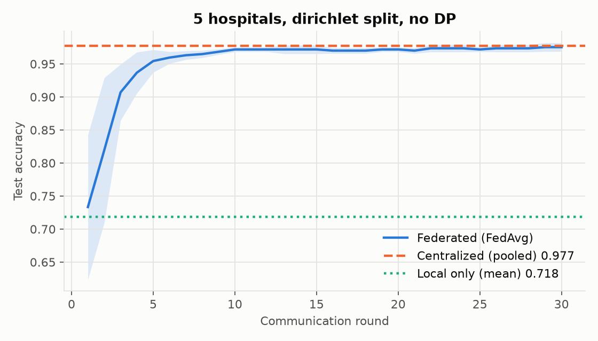
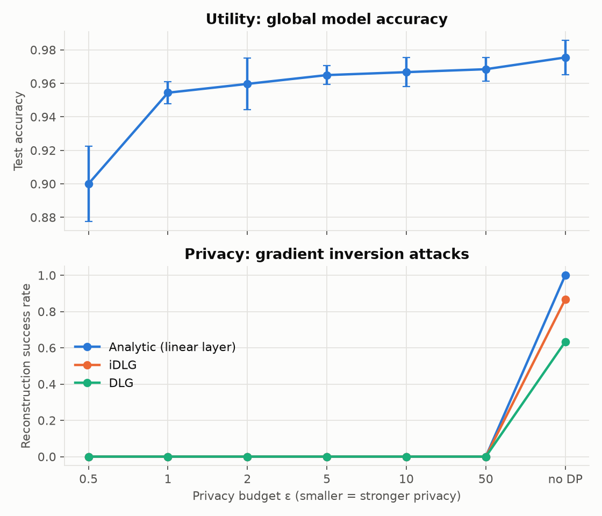

# FedSecHealth

**A reproducible testbed for privacy & security attacks and defenses in federated learning on medical data.**

[](https://github.com/OWNER/FedSecHealth/actions/workflows/ci.yml)


🇬🇧 English · [🇫🇷 Français](#-version-française)

---

Hospitals want to train models together without sharing patient records.
Federated Learning (FL) promises exactly that: only model updates leave the
hospital. **But gradients leak data.** FedSecHealth simulates hospitals
collaborating on a diagnostic model, lets an honest-but-curious server
**reconstruct patient records from their gradients**, and measures how
well defenses such as **Differential Privacy (DP-SGD)** stop the attack and
what they cost in accuracy.

## Key results (v0.1, Breast Cancer Wisconsin)

**1. Federation helps when hospitals differ.** Five hospitals with strongly
label-skewed data (Dirichlet α = 0.3). Mean ± std over 5 seeds:

<p align="center"></p>

| Setting | Test accuracy |
|---|---|
| Each hospital alone (mean) | **0.718** |
| Federated (FedAvg, 30 rounds) | **0.975** |
| Centralized (pooled data, not private) | **0.977** |

**2. Gradients leak patient records, exactly.** One gradient computed on a
single patient is enough for the server to recover all 30 clinical features and
the diagnosis:

| Feature | Real patient | Reconstructed (no DP) | Reconstructed (DP, ε=5) |
|---|---:|---:|---:|
| diagnosis | malignant | malignant | benign |
| mean radius | 15.100 | 15.100 | 6.877 |
| mean texture | 22.020 | 22.020 | 11.097 |
| mean perimeter | 97.260 | 97.260 | 194.077 |
| mean area | 712.800 | 712.802 | 1651.659 |
| mean smoothness | 0.091 | 0.091 | 0.030 |
| mean compactness | 0.071 | 0.071 | 0.480 |

*Patient from hospital 0, iDLG attack on a freshly initialised model. First 6 of 30 features shown.*

**3. Differential privacy breaks the attack at a small accuracy cost.**

<p align="center"></p>

| Privacy budget ε | Accuracy, 3 hospitals IID | Accuracy, 5 hospitals non-IID | Analytic | iDLG | DLG |
|---|---|---|---|---|---|
| 0.5 | 0.900 ± 0.023 | 0.775 ± 0.078 | 0% | 0% | 0% |
| 1 | 0.954 ± 0.007 | 0.879 ± 0.029 | 0% | 0% | 0% |
| 2 | 0.960 ± 0.015 | 0.947 ± 0.021 | 0% | 0% | 0% |
| 5 | 0.965 ± 0.006 | 0.965 ± 0.006 | 0% | 0% | 0% |
| 10 | 0.967 ± 0.009 | 0.967 ± 0.007 | 0% | 0% | 0% |
| 50 | 0.968 ± 0.007 | 0.965 ± 0.008 | 0% | 0% | 0% |
| ∞ (no DP) | 0.975 ± 0.010 | 0.975 ± 0.007 | 100% | 87% | 63% |
| clipping only (σ = 0) | n/a | n/a | 100% | 13% | 60% |

*Accuracy: mean ± std over 5 seeds after 30 rounds. Attack success: share of 30 target patients (IID config, batch of 1) reconstructed with < 10 % relative error.*

### Takeaways

- **Clipping alone is not a defense.** Per-sample clipping only rescales the
  gradient, and the analytic attack computes a *ratio* (∂L/∂W ÷ ∂L/∂b) in which
  the scale cancels: 100 % success. iDLG drops because its hard-coded label
  cannot absorb the rescaling, while DLG's soft label partly can. The Gaussian
  noise is what protects patients.
- **Even a weak formal budget (ε = 50) stops these attacks here.** Clipped to
  norm 1, a single patient's gradient spreads over ~4 k parameters, while the
  noise (σ ≈ 0.6) is added to *every* coordinate. Reconstructions become noise,
  and label guesses fall to roughly chance (40 to 73 % over 30 targets).
- **Heterogeneity makes DP more expensive.** At ε = 1, IID hospitals keep 95.4 %
  accuracy but non-IID hospitals drop to 87.9 %. Small, skewed hospitals are
  exactly where noise hurts most.

### Limitations (honest scope of v0.1)

- Tabular data with a small MLP: reconstruction is easy without DP, and success
  under DP says nothing yet about images or larger batches (planned for v0.2).
- Attacks target a freshly initialised model and a single-sample gradient
  (the standard, worst-case benchmark), not multi-step FedAvg updates.
- 30 targets per setting: rates are indicative, not tight estimates.
- Opacus warns that the RDP bound is loose at ε = 0.5 (the optimal order hits the
  largest α). The reported ε is therefore conservative, not an underestimate.

## What's inside

| Component | Details |
|---|---|
| Data | Breast Cancer Wisconsin (569 patients, 30 features); IID or **Dirichlet non-IID** splits; **federated feature standardisation** (hospitals only share sums, never records) |
| FL engine | Deterministic FedAvg simulator in pure PyTorch; centralized and local-only baselines |
| Attacks | **Analytic** linear-layer inversion (Phong et al. 2017), **DLG** (Zhu et al. 2019), **iDLG** (Zhao et al. 2020) |
| Defenses | **DP-SGD** per hospital via Opacus, with RDP (ε, δ) accounting |
| Engineering | `src/` package, typed YAML configs, CLI, tests, CI, ruff |

## Threat model

- **Adversary:** an *honest-but-curious* aggregation server (or anyone who
  intercepts updates). It follows the protocol, knows the architecture and the
  current weights, and observes each hospital's update.
- **Goal:** recover the private inputs (patient features) and labels (diagnosis).
- **Setting:** the update is the gradient of one local step (FedSGD). This is the
  worst case for the hospital and the standard benchmark setting for gradient inversion.
- **Success criterion:** relative L2 error ‖x̂ − x‖ / ‖x‖ < 10 % in standardised feature space.
- **DP noise in attacks** is calibrated with the *same* schedule as training
  (sampling rate, number of steps, δ = 1e-5), so each ε in the attack study is the
  budget a hospital would actually spend.

## Quick start

```bash
git clone https://github.com/OWNER/FedSecHealth && cd FedSecHealth
uv sync                                               # installs CPU PyTorch + deps
uv run fedsechealth train    -c configs/breast_cancer_noniid.yaml
uv run fedsechealth demo     -c configs/breast_cancer_iid.yaml --epsilon 5
uv run fedsechealth tradeoff -c configs/breast_cancer_iid.yaml
uv run pytest
```

Override any config value from the command line: `-s fl.rounds=10 -s fl.dp.enabled=true`.
Outputs (JSON + figures) go to `results/<experiment name>/`.

## Project layout

```
src/fedsechealth/
  data.py          datasets, IID / Dirichlet partitions, federated standardisation
  models.py        Opacus-compatible models
  fl.py            hospitals, FedAvg, baselines, DP-SGD training
  privacy.py       DP config, noise calibration, DP gradient release
  attacks/         gradient inversion (analytic, DLG, iDLG)
  experiments.py   train / attack / trade-off / demo pipelines
  cli.py           command-line interface
configs/           YAML experiment definitions
tests/             pytest suite
```

## Roadmap

Medical imaging (MedMNIST) + Inverting Gradients → malicious hospitals
(poisoning, backdoors) + robust aggregation → membership inference and secure
aggregation → Flower/Docker deployment and dashboard. See [ROADMAP.md](ROADMAP.md).

## References

- McMahan et al., *Communication-Efficient Learning of Deep Networks from Decentralized Data*, AISTATS 2017.
- Abadi et al., *Deep Learning with Differential Privacy*, CCS 2016.
- Phong et al., *Privacy-Preserving Deep Learning via Additively Homomorphic Encryption*, IEEE TIFS 2017.
- Zhu, Liu, Han, *Deep Leakage from Gradients*, NeurIPS 2019.
- Zhao, Mopuri, Bilen, *iDLG: Improved Deep Leakage from Gradients*, 2020.
- Geiping et al., *Inverting Gradients: How easy is it to break privacy in federated learning?*, NeurIPS 2020.
- Hsu, Qi, Brown, *Measuring the Effects of Non-Identical Data Distribution for Federated Visual Classification*, 2019.

---

## 🇫🇷 Version française

**Un banc d'essai reproductible des attaques et défenses sur la vie privée et la sécurité en apprentissage fédéré appliqué aux données médicales.**

Des hôpitaux veulent entraîner un modèle commun sans partager les dossiers de
leurs patients. Le Federated Learning (FL) le permet : seules les mises à jour
du modèle quittent l'hôpital. **Mais les gradients laissent fuiter les
données.** FedSecHealth simule des hôpitaux qui collaborent sur un modèle de
diagnostic, laisse un serveur « honnête mais curieux » **reconstruire les
dossiers patients à partir de leurs gradients**, puis mesure l'efficacité des
défenses comme la **confidentialité différentielle (DP-SGD)** et leur coût en
précision.

### Résultats principaux (v0.1)

1. **La fédération est utile quand les hôpitaux sont hétérogènes.** Avec 5
   hôpitaux aux données très déséquilibrées (Dirichlet α = 0,3), un hôpital seul
   atteint **71,8 %** de précision, le modèle fédéré **97,5 %**, soit
   quasiment le niveau d'un entraînement centralisé (97,7 %) sans jamais
   mettre les données en commun.
2. **Les gradients révèlent les dossiers patients, exactement.** Un seul
   gradient suffit au serveur pour retrouver les 30 caractéristiques cliniques
   et le diagnostic (voir le tableau plus haut).
3. **La confidentialité différentielle met l'attaque en échec pour un faible
   coût en précision.** Aucune reconstruction ne réussit dès que le bruit DP
   est présent, même à ε = 50, alors que la précision reste à 96,5 % à ε = 5
   (contre 97,5 % sans DP).

### Enseignements

- **Le clipping seul ne protège pas.** Il ne fait que changer l'échelle du
  gradient, et l'attaque analytique calcule un *ratio* où cette échelle
  s'annule : 100 % de réussite. C'est le bruit gaussien qui protège.
- **Même un budget faible (ε = 50) suffit ici** : le gradient d'un patient,
  borné en norme à 1, est réparti sur ~4 000 paramètres, alors que le bruit
  (σ ≈ 0,6) s'ajoute à chacun d'eux.
- **L'hétérogénéité rend la DP plus coûteuse** : à ε = 1, la précision est de
  95,4 % en IID mais de 87,9 % en non-IID.

### Limites

Données tabulaires et petit MLP ; attaques sur un modèle fraîchement
initialisé avec un gradient calculé sur un seul patient (le cas de référence
de la littérature) ; 30 cibles par configuration. L'imagerie et les lots plus
grands arrivent en v0.2.

### Modèle de menace

Le serveur d'agrégation suit le protocole mais cherche à apprendre des
informations sur les patients. Il connaît l'architecture et les poids, et
observe la mise à jour de chaque hôpital (gradient d'une étape locale, le
pire cas). Une reconstruction est réussie si l'erreur relative est
inférieure à 10 %. Le bruit DP utilisé dans les attaques est calibré sur le
même calendrier que l'entraînement, donc chaque ε correspond au budget
réellement dépensé par un hôpital.

### Démarrage rapide

```bash
uv sync
uv run fedsechealth train    -c configs/breast_cancer_noniid.yaml
uv run fedsechealth demo     -c configs/breast_cancer_iid.yaml --epsilon 5
uv run fedsechealth tradeoff -c configs/breast_cancer_iid.yaml
```

### Feuille de route

Imagerie médicale (MedMNIST) et Inverting Gradients, puis hôpitaux
malveillants (empoisonnement, backdoors) et agrégation robuste, puis inférence
d'appartenance et agrégation sécurisée, puis déploiement Flower/Docker et
tableau de bord. Voir [ROADMAP.md](ROADMAP.md).

## License

MIT, see [LICENSE](LICENSE).
